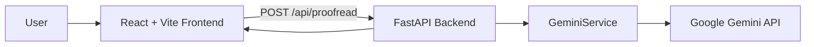
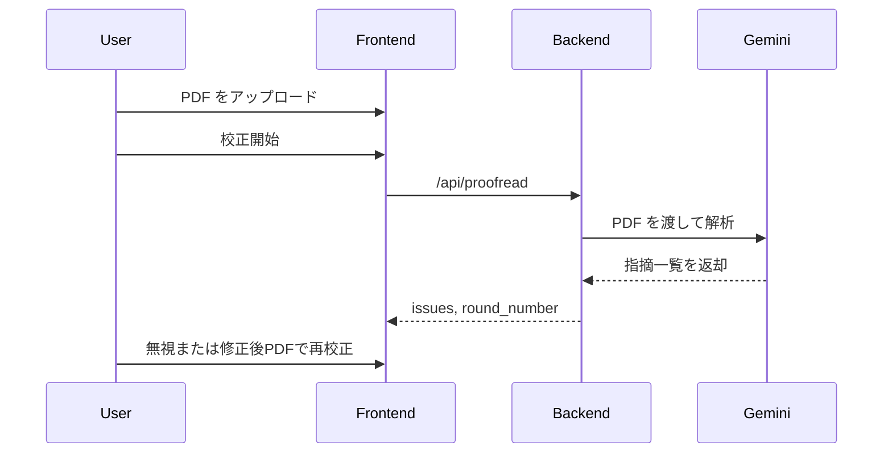

# PaperProofer

論文 PDF をアップロードするだけで、Gemini が体裁上の問題点をチェックリストに沿って洗い出す論文校正アプリです。

## 開発した背景

論文執筆では、研究内容そのものだけでなく、表記ゆれ、図表の扱い、参考文献の書式、論文調の崩れといった体裁面の確認にも多くの時間がかかります。特に PDF を目視で見ながら細かな違反を探す作業は負荷が高く、見落としも起こりやすいです。

このアプリは、論文 PDF を入力するだけで、定義済みのチェックリストに沿って形式上の問題を抽出し、修正候補と理由を一覧で確認できるようにすることを目的に開発しました。

## アプリ公開URL

- 未公開
- ローカルフロントエンド: `http://localhost:5173`
- ローカルバックエンド API: `http://localhost:8000`
- ローカル Swagger UI: `http://localhost:8000/docs`

## アプリに関する記事のURL

- 未執筆

## 目次

- [主要機能](#主要機能)
- [デモ動画 or スクリーンショット](#デモ動画-or-スクリーンショット)
- [使用技術について](#使用技術について)
- [環境構築手順](#環境構築手順)
- [こだわり／工夫した点](#こだわり工夫した点)
- [ダイアグラム](#ダイアグラム)
- [API一覧](#api一覧)
- [今後の展望](#今後の展望)

## 主要機能

- 論文 PDF をアップロードして校正を開始
- Gemini に PDF を渡し、チェックリストに基づく指摘事項を抽出
- 指摘ごとに問題箇所、修正候補、該当チェック項目、理由を表示
- 不要な指摘を無視リストに追加
- 修正後の PDF を再アップロードして再校正
- ラウンド番号を保持しながら継続的に確認

## デモ動画 or スクリーンショット

- 現時点では未追加

## 使用技術について

### フロントエンド

| カテゴリ | 使用技術 | バージョン |
| --- | --- | --- |
| 言語 | TypeScript | `~5.9.3` |
| UI | React | `^19.2.0` |
| ビルドツール | Vite | `^7.2.4` |
| Lint | ESLint | `^9.39.1` |

### バックエンド

| カテゴリ | 使用技術 | バージョン |
| --- | --- | --- |
| 言語 | Python | `>=3.12` |
| Web フレームワーク | FastAPI | `>=0.115.0` |
| ASGI サーバ | Uvicorn | `>=0.32.0` |
| スキーマ定義 | Pydantic | `>=2.10.0` |
| 環境変数管理 | python-dotenv | `>=1.0.0` |
| LLM 連携 | langchain-core | `>=0.3.0` |
| Gemini 連携 | langchain-google-genai | `>=2.0.0` |
| パッケージ管理 | uv | `uv.lock` 管理 |
| テスト | pytest / pytest-asyncio | `>=8.0.0` / `>=0.24.0` |

### インフラ / デプロイ

| カテゴリ | 使用技術 | バージョン |
| --- | --- | --- |
| ホスティング候補 | Render Web Service / Static Site | 2026年4月時点の構成 |
| デプロイ設定 | `render.yaml` | リポジトリ同梱 |

### API / AI

| カテゴリ | 使用技術 | バージョン |
| --- | --- | --- |
| LLM | Google Gemini | 環境変数 `GEMINI_MODEL` で指定 |
| API 形式 | REST API | JSON |
| API ドキュメント | Swagger UI / OpenAPI | FastAPI 標準機能 |

## 環境構築手順

### 前提

- Python `3.12` 以上
- Node.js `20` 以上
- `uv`
- Gemini API を利用可能な `GOOGLE_API_KEY`

### 1. リポジトリを取得

```bash
git clone <repository-url>
cd paperproofer
```

### 2. バックエンドをセットアップ

```bash
cd backend
uv venv
uv pip install -e ".[dev]"
```

`.env` を作成して API キーとモデル、CORS を設定します。

```env
GOOGLE_API_KEY=your_gemini_api_key_here
GEMINI_MODEL=gemini-1.5-pro
CORS_ORIGINS=http://localhost:5173
```

### 3. フロントエンドをセットアップ

```bash
cd frontend
npm install
```

必要に応じて `.env.local` を作成し、API の接続先を指定します。

```env
VITE_API_BASE_URL=http://localhost:8000/api
```

### 4. バックエンドを起動

```bash
cd backend
uv run uvicorn app.main:app --reload --port 8000
```

### 5. フロントエンドを起動

```bash
cd frontend
npm run dev
```

### 6. ブラウザで確認

- フロントエンド: `http://localhost:5173`
- API Docs: `http://localhost:8000/docs`

### 7. Render にデプロイ

このリポジトリには `render.yaml` を含めています。Render の Blueprint 機能で、API とフロントエンドをまとめて作成できます。

1. Render のダッシュボードで `New > Blueprint` を選択する
2. この GitHub リポジトリを接続する
3. `render.yaml` を読み込ませる
4. まずバックエンド `paperproofer-api` をデプロイする
5. バックエンドの公開 URL を確認する
6. フロントエンド `paperproofer-web` の `VITE_API_BASE_URL` に `https://<backend-domain>/api` を設定する
7. バックエンドの `CORS_ORIGINS` に `https://<frontend-domain>` を設定する
8. 再デプロイして疎通確認する

#### Render で設定する環境変数

バックエンド:

```env
GOOGLE_API_KEY=your_gemini_api_key_here
GEMINI_MODEL=gemini-1.5-pro
CORS_ORIGINS=https://<frontend-domain>
```

フロントエンド:

```env
VITE_API_BASE_URL=https://<backend-domain>/api
```

#### Render 参考ドキュメント

- [Blueprint YAML Reference](https://render.com/docs/blueprint-spec)
- [Web Services](https://render.com/docs/web-services)
- [Static Sites](https://render.com/docs/static-sites)
- [Environment Variables and Secrets](https://render.com/docs/configure-environment-variables)

## こだわり／工夫した点

- PDF のみを入力にした点
  学生や研究室メンバーが LaTeX ソースを持っていなくても、完成版 PDF を使って校正できます。
- 指摘を構造化データで返す点
  `issue_id`、問題箇所、修正候補、チェック項目、理由を返すため、UI で一覧表示しやすい構成です。
- 無視リストを持って再校正できる点
  利用者が不要と判断した指摘を次回以降の校正で抑制できます。
- Render を前提にした環境変数構成にしている点
  CORS と API ベース URL をコードに埋めず、ローカルと本番を切り替えやすくしています。

## ダイアグラム

### システム構成図



### 処理フロー



## API一覧

| メソッド | エンドポイント | 概要 |
| --- | --- | --- |
| `POST` | `/api/proofread/` | 論文 PDF をもとに指摘事項一覧を返す |
| `GET` | `/` | API 稼働確認用メッセージを返す |

### `POST /api/proofread/`

リクエスト例:

```json
{
  "pdf_base64": "string",
  "ignored_issues": [],
  "round_number": 0
}
```

レスポンス例:

```json
{
  "issues": [
    {
      "issue_id": "1",
      "before_text": "And this sentence starts with And.",
      "after_text": "This sentence should not start with And.",
      "checklist_item": "文頭で and, but, so を使ってはいけない",
      "violation_reason": "口語的な表現に該当するため"
    }
  ],
  "round_number": 1
}
```

## 今後の展望

- スクリーンショットやデモ動画の追加
- 投稿先や論文種別ごとに切り替えられるチェックリスト設定
- 指摘の信頼度やカテゴリ分類の追加
- PDF 内の該当位置ハイライト
- Render への本番デプロイと公開 URL の整備
